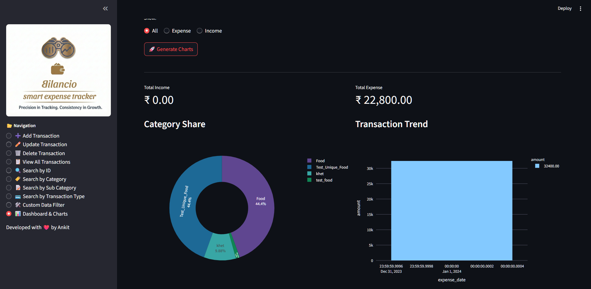
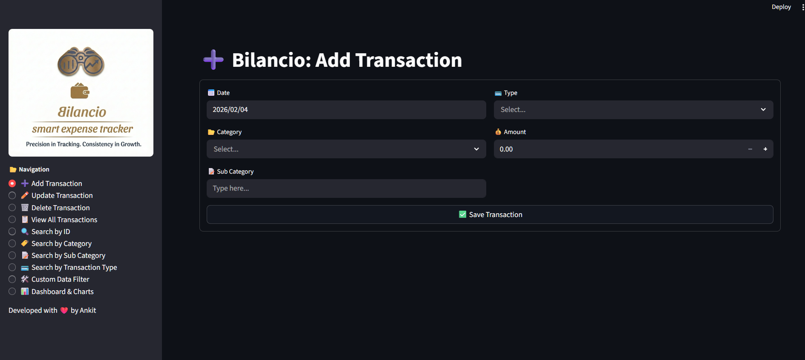
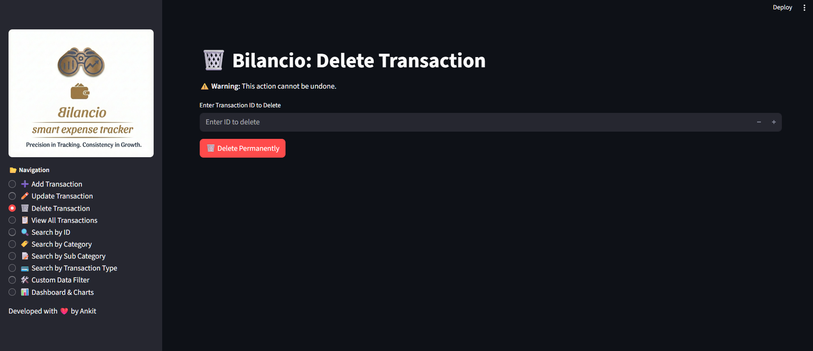
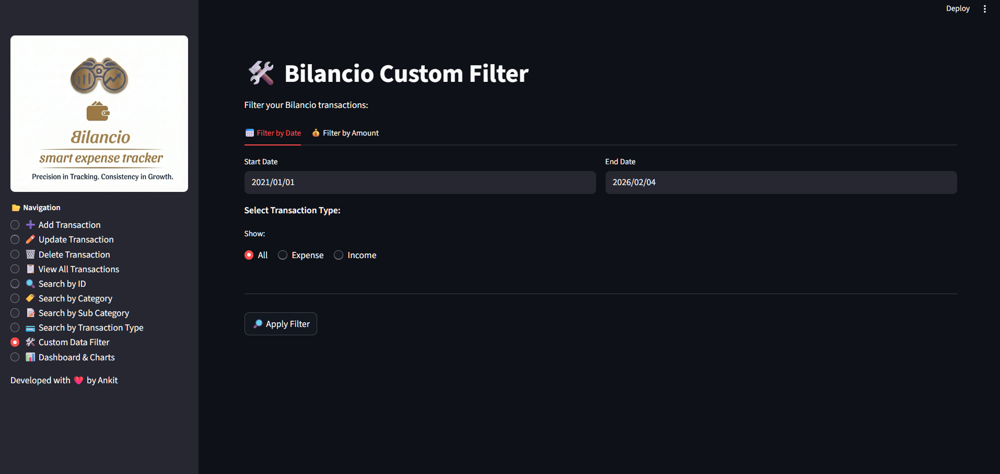
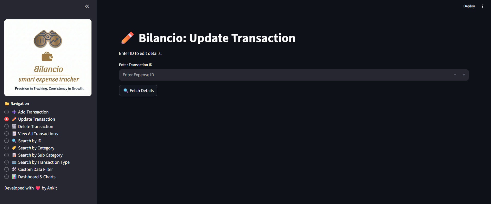

<div align="center">

  
  
  # 💸 Bilancio: Smart Expense Tracker

  <p>
    <b>Track. Analyze. Save.</b><br>
    A powerful tool to take control of your financial life.
  </p>

  <p>
    <a href="https://python.org">
      
    </a>
    <a href="https://streamlit.io">
      
    </a>
    <a href="https://mysql.com">
      
    </a>
    <a href="https://pandas.pydata.org">
      
    </a>
  </p>

  <br>

  

</div>

---

## 📖 Overview

**Bilancio** is your personal financial assistant. Built with a robust **Python** backend and a responsive **Streamlit** frontend, it allows users to log daily transactions, visualize spending trends, and export reports with ease.

---

## ✨ Top Features

* **📊 Interactive Dashboard:** Visualize your spending with dynamic Pie Charts & Bar Graphs.
* **➕ Easy Entry:** Add Income/Expenses quickly with categories and notes.
* **🔎 Smart Search:** Filter transactions by Date Range, Category, or Amount.
* **🗑️ Secure Management:** Update or Delete wrong entries instantly.
* **💾 Data Export:** Download your financial history as a CSV file.

---

## 📸 Application Tour

<div align="center"> 
  
  
  
  <br><br>

  
  
</div>

---

## 🛠️ Tech Stack

| Component | Technology | Description |
| :--- | :--- | :--- |
| **Frontend** | `Streamlit` | For building the interactive web UI. |
| **Backend** | `Python` | Handles logic, calculations, and routing. |
| **Database** | `MySQL` | Stores all transaction records securely. |
| **Visualization** | `Plotly/Pandas` | Powers the beautiful analytics charts. |

---

## 🚀 Quick Start Guide

**1. Clone the Repository**
```bash
git clone [https://github.com/Abk-05/Bilancio---Smart-Expense-Tracker.git](https://github.com/Abk-05/Bilancio---Smart-Expense-Tracker.git)
cd Bilancio---Smart-Expense-Tracker


## Setup Instructions

2.  **MySQL Server** (The database software) -> [Download Here](https://dev.mysql.com/downloads/installer/)
1. **Install dependencies:**:   
   ```commandline
    pip install -r requirements.txt
   ```
1. **Run the FastAPI server:**:   
   ```commandline
     python -m uvicorn backend.server:app --reload
   ```
1. **Run the Streamlit app:**:   
   ```commandline
    python -m streamlit run frontend/app.py

